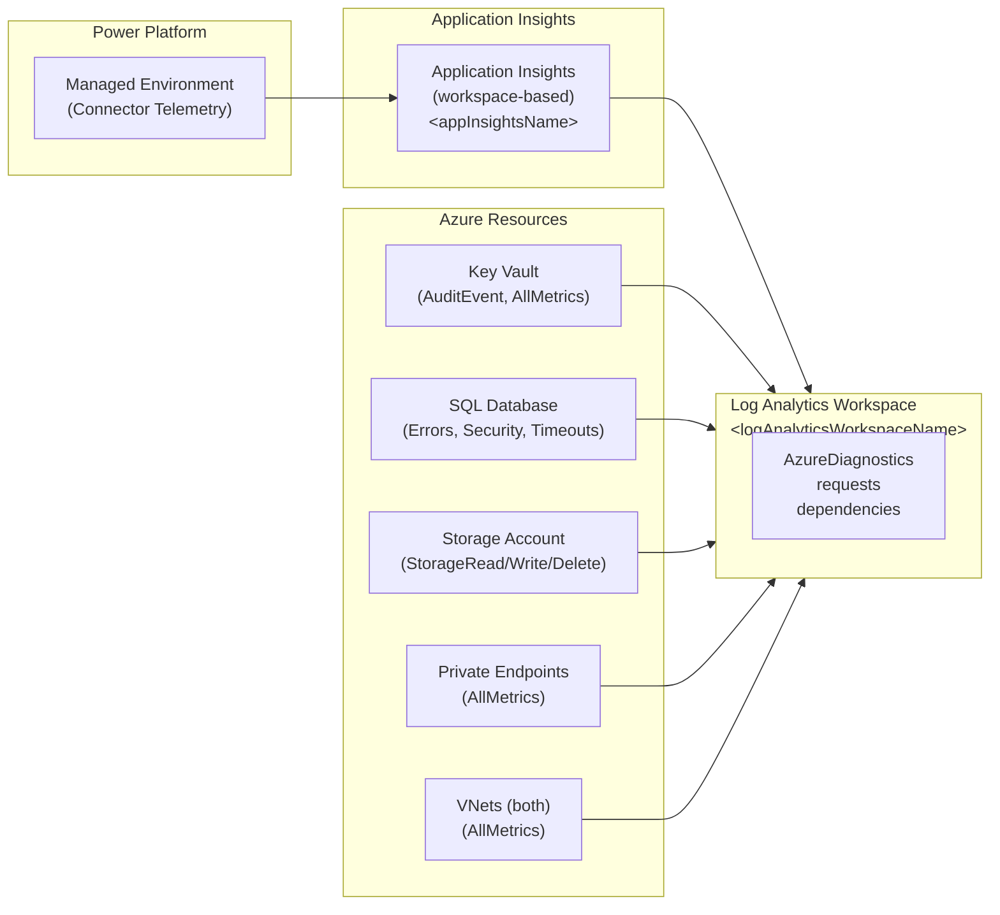

# Monitoring private endpoint traffic

This guide shows Azure and Power Platform operators how to monitor traffic flowing from Power Platform Managed Environments to Azure private resources through private endpoints over delegated subnets. Telemetry is essential to verify that requests are using the private path (not public), to catch denied public attempts, and to validate that DNS resolution and private endpoint health are stable.

## Contents

- [What gets logged](#what-gets-logged)
- [Architecture of the telemetry flow](#architecture-of-the-telemetry-flow)
- [Key questions and KQL queries](#key-questions-and-kql-queries)
- [Setting up dashboards](#setting-up-dashboards)
- [Alerts](#alerts)
- [Troubleshooting flow](#troubleshooting-flow)
- [Cost note](#cost-note)
- [References](#references)

## What gets logged

The deployment includes diagnostic settings that capture resource-specific telemetry on Key Vault, Azure SQL Database, Storage, and private endpoints. The following table shows what diagnostic categories are enabled for each resource:

| Resource | Category | Retention | Notes |
|----------|----------|-----------|-------|
| **Key Vault** | `AuditEvent` | 30 days | All secret, key, and certificate access; includes caller identity and IP. |
| **Key Vault** | `AzurePolicyEvaluationDetails` | 30 days | Firewall and access policy decisions. |
| **Key Vault** | `AllMetrics` | 30 days | API latency, availability, request counts. |
| **Azure SQL Database** | `Errors` | 30 days | Authentication failures, query timeouts, connectivity errors. |
| **Azure SQL Database** | `Security` | 30 days | Login attempts (success and failures). |
| **Azure SQL Database** | `Timeouts` | 30 days | Query execution timeouts. |
| **Storage Account** | `StorageRead` | 30 days | GET, HEAD, read operations (blob and container). |
| **Storage Account** | `StorageWrite` | 30 days | PUT, POST, write operations. |
| **Storage Account** | `StorageDelete` | 30 days | DELETE operations. |
| **Private Endpoints** (KV, SQL, Blob) | `AllMetrics` only | 30 days | No diagnostic log categories exist for PE; metrics cover throughput and connection count. |
| **VNet (both regions)** | `AllMetrics` | 30 days | Network flow data (aggregated). |

All diagnostic logs flow to a shared **Log Analytics workspace**, named `<logAnalyticsWorkspaceName>`. A separate **Application Insights** instance (workspace-based), named `<appInsightsName>`, captures telemetry from Power Platform flows and connectors running in the Managed Environment.

---

## Architecture of the telemetry flow

The monitoring plane combines two independent data streams into one Log Analytics workspace:

1. **Application Insights path:** Power Platform Managed Environment → Application Insights (workspace-based) → Log Analytics workspace (`requests`, `dependencies`, `customMetrics` tables).
2. **Resource diagnostics path:** Azure resources (Key Vault, SQL, Storage, private endpoints, VNets) → Diagnostic Settings → Log Analytics workspace (`AzureDiagnostics` table).

This two-stream approach allows operators to correlate flow runtime events (from App Insights) with detailed access logs from the backend resources.



---

## Key questions and KQL queries

Use these Kusto Query Language (KQL) queries against the Log Analytics workspace to answer the most common operational questions.

### Query (a): "Is Power Platform reaching Key Vault over the private endpoint?"

This query shows all Key Vault access from the delegated subnets (private IPs). Success indicates the private path is working:

```kusto
AzureDiagnostics
| where ResourceType == "VAULTS"
| where TimeGenerated > ago(24h)
| where CallerIPAddress in ("10.10.0.0/27", "10.20.0.0/27") or CallerIPAddress startswith "10."
| project
    TimeGenerated,
    OperationName,
    CallerIPAddress,
    identity_claim_xms_mirid_s,
    ResultType,
    HttpStatusCode,
    requestUri_s
| order by TimeGenerated desc
```

**Expected behavior:** `CallerIPAddress` should match a private IP from the delegated subnet range (eastus: `10.10.0.0/27`; westus: `10.20.0.0/27`). If you see public IPs (1.2.3.4 range) accessing secrets, it means public access is somehow still enabled or the private endpoint is not in use.

### Query (b): "Are there any public-endpoint attempts being denied?"

This query detects attempts to reach Key Vault from public IPs and shows denied requests:

```kusto
AzureDiagnostics
| where ResourceType == "VAULTS"
| where TimeGenerated > ago(24h)
| where ResultType in ("Forbidden", "Denied") or HttpStatusCode in (403, 401)
| where CallerIPAddress !startswith "10."
| project
    TimeGenerated,
    OperationName,
    CallerIPAddress,
    ResultType,
    HttpStatusCode,
    identity_claim_xms_mirid_s,
    requestUri_s
| order by TimeGenerated desc
| limit 50
```

**Expected behavior:** A small number of denied requests from public IPs is normal if you are testing from your workstation. A spike in denials might indicate misconfiguration or an attack pattern.

### Query (c): "Who/what accessed which secret in the last hour?"

This query shows all secret retrieval attempts (successful and failed) with caller identity:

```kusto
AzureDiagnostics
| where ResourceType == "VAULTS"
| where TimeGenerated > ago(1h)
| where OperationName == "SecretGet" or OperationName == "SecretSet"
| project
    TimeGenerated,
    OperationName,
    CallerIPAddress,
    identity_claim_appid_g,
    identity_claim_oid_g,
    ResultType,
    HttpStatusCode,
    requestUri_s
| order by TimeGenerated desc
```

**Expected behavior:** Secrets should only be accessed from the delegated subnet IPs (10.10.0.0/27 or 10.20.0.0/27). The `identity_claim_appid_g` field holds the Azure AD app ID (often the UAMI or service principal). All operations should return `200` (success) or `403` if the identity lacks permissions.

### Query (d): "Is the private endpoint healthy?"

This query uses Azure Metrics to check private endpoint status and data throughput:

```kusto
AzureMetrics
| where ResourceType == "privateEndpoints"
| where TimeGenerated > ago(24h)
| where MetricName in ("PrivateEndpointConnectionStatus", "BytesIn", "BytesOut")
| summarize
    LatestStatus=max(iff(MetricName == "PrivateEndpointConnectionStatus", todouble(Average), real(null))),
    TotalBytesIn=sum(iff(MetricName == "BytesIn", Sum, 0.0)),
    TotalBytesOut=sum(iff(MetricName == "BytesOut", Sum, 0.0))
    by ResourceId, bin(TimeGenerated, 1h)
| project
    TimeGenerated,
    ResourceId,
    LatestStatus,
    TotalBytesIn,
    TotalBytesOut
| order by TimeGenerated desc
```

**Expected behavior:**
- `PrivateEndpointConnectionStatus` should be `1` (healthy). A value of `0` or missing indicates the PE is disconnected or degraded.
- `BytesIn` and `BytesOut` should show steady traffic during normal operation. Zero bytes over several hours suggests no data is flowing through the endpoint (possible misconfiguration).

### Query (e): "Is DNS resolution working?"

Azure does not provide direct telemetry for private DNS zone queries from inside a VNet. However, you can validate DNS indirectly by checking whether Key Vault and Storage access logs show requests arriving at the correct private endpoint IP:

```kusto
AzureDiagnostics
| where ResourceType in ("VAULTS", "StorageAccounts")
| where TimeGenerated > ago(1h)
| summarize
    RequestCount=count(),
    UniqueCallerIPs=dcount(CallerIPAddress),
    SuccessCount=countif(ResultType == "Success"),
    DeniedCount=countif(ResultType in ("Forbidden", "Denied"))
    by ResourceId, bin(TimeGenerated, 5m)
| order by TimeGenerated desc
```

**Expected behavior:** If DNS is working correctly, all requests should arrive at the resource through the private endpoint subnet (snet-pep). A sudden drop in request count could indicate DNS resolution failure.

**Alternative validation:** For operational proof of DNS behavior, schedule the network validation script as a regular health check:

```bash
./scripts/03-validate-network.sh
```

This script checks private DNS A-record resolution and compares it to the actual private endpoint IP. Optionally, if you later add an [Azure DNS Private Resolver](https://learn.microsoft.com/en-us/azure/dns/dns-private-resolver-overview), enable its query logs (out of scope for this lab) to see resolver-level DNS query patterns.

### Query (f): "Did the Power Platform side log a request? Can I correlate it with the backend access log?"

This query joins Application Insights request telemetry with Key Vault audit logs, binning both by 5-second windows to find matching pairs:

```kusto
requests
| where timestamp > ago(1h)
| where name contains "KeyVault" or url contains "vault"
| project
    AppRequestTime=timestamp,
    AppRequestName=name,
    AppDurationMs=duration,
    AppResultCode=resultCode
| join kind=inner (
    AzureDiagnostics
    | where ResourceType == "VAULTS"
    | where TimeGenerated > ago(1h)
    | where OperationName == "SecretGet"
    | project
        KVTime=TimeGenerated,
        KVOperationName=OperationName,
        KVStatus=ResultType,
        KVCallerIP=CallerIPAddress
)
on $left.AppRequestTime == $right.KVTime
| where abs(datetime_diff('second', AppRequestTime, KVTime)) < 5
| project
    AppRequestTime,
    AppRequestName,
    AppDurationMs,
    AppResultCode,
    KVOperationName,
    KVStatus,
    KVCallerIP
| order by AppRequestTime desc
| limit 20
```

**Expected behavior:** A successful request from Power Platform (HTTP 200 from the app) should have a matching Key Vault `AuditEvent` log showing a `SecretGet` operation with the caller IP from the delegated subnet. A mismatch (app success but no KV log) suggests the request did not reach the backend, or the backend log is delayed (logs have ~5-minute latency).

---

## Setting up dashboards

After verifying the Log Analytics workspace and queries are working, pin the six queries above to an **Azure Dashboard** for continuous monitoring:

1. Go to the **Log Analytics workspace** in the Azure portal.
2. For each query, click **Pin to dashboard**.
3. Create a new dashboard or add to an existing one named `<envId>-monitoring` (where `<envId>` is the Power Platform environment ID).
4. Arrange the six query tiles to show:
   - Query (a) — Private endpoint traffic (top-left)
   - Query (b) — Denied public attempts (top-right)
   - Query (c) — Secret access audit (middle-left)
   - Query (d) — Private endpoint health (middle-right)
   - Query (e) — DNS and connectivity check (bottom-left)
   - Query (f) — Cross-layer correlation (bottom-right)

For a more polished experience, consider creating an **Azure Workbook** template that bundles these queries with narrative explanations and automated alerts. Workbook JSON can be added in a future iteration; for this lab, the dashboard approach is sufficient.

---

## Alerts

The infrastructure deployment includes an optional **alerts module** that creates three proactive alerts:

1. **Key Vault denial spike:** Triggers if denied requests exceed 10 in a 5-minute window.
2. **Key Vault availability drop:** Triggers if successful operations fall below 95% for 15 minutes.
3. **Private endpoint health degraded:** Triggers if endpoint status drops below 1 (healthy).

### Enabling alerts

By default, the alerts module is disabled (`enableAlerts=false`). To enable:

```bash
az deployment sub create \
  --name deploy-alerts \
  --location eastus \
  --template-file infra/main.bicep \
  --parameters enableAlerts=true
```

### Configuring notifications

Alerts require an **action group** with at least one notification target (email, SMS, webhook, Azure Function). The deployment creates an empty action group; you must add receivers:

```bash
az monitor action-group create \
  --name ag-pbinet-alerts \
  --resource-group <resource-group> \
  --short-name PBIAlerts

az monitor action-group update \
  --name ag-pbinet-alerts \
  --resource-group <resource-group> \
  --add-action email-receiver \
    --action-name SendToOps \
    --email-address ops-team@contoso.com
```

Once the action group has receivers, alerts will notify the team when thresholds are crossed. Check alert firing by querying the Log Analytics workspace for the alert rule name.

---

## Troubleshooting flow

If a flow cannot reach a private resource, follow this decision tree:

**Flow fails with "connection timeout" or "403 Forbidden" :**

1. **Run the network validation script** to confirm network plumbing:
   ```bash
   ./scripts/03-validate-network.sh
   ```
   If this passes, proceed to step 2. If it fails, the VNet, DNS zone, or private endpoint is misconfigured — contact the Azure admin to re-run `scripts/01-deploy.sh`.

2. **Check Key Vault AuditEvent logs in the last 15 minutes** (query c above).
   - If you see `SecretGet` with `ResultType=Success`, the network is fine; check the flow logic.
   - If you see no logs, proceed to step 3.

3. **Check private endpoint health** (query d above).
   - If status is `1` (healthy) and throughput is non-zero, the endpoint is up. Proceed to step 4.
   - If status is `0` or throughput is zero, the endpoint is disconnected. Contact the Azure admin to check Network Interface state and re-link the private DNS zone if needed.

4. **Verify DNS resolution within the delegated subnet** by running the network validation script again with verbose output:
   ```bash
   ./scripts/03-validate-network.sh -v
   ```
   - If `nslookup` of `<keyVaultName>.vault.azure.net` returns `10.10.1.x` (private endpoint IP), DNS is working.
   - If DNS returns a public IP or fails, ask the Azure admin to re-link the private DNS zones to both VNets.

5. **Escalate to Power Platform setup:** If all Azure-side telemetry is healthy, the issue may be with the Managed Environment linkage. Re-run:
   ```powershell
   ./scripts/02-configure-pp-vnet.ps1
   ```
   This script is idempotent — running it twice with the same parameters is safe and will fix a missing or stale enterprise policy link.

---

## Cost note

The telemetry infrastructure incurs charges for **Log Analytics workspace** storage and **Application Insights**:

- **Log Analytics workspace (PerGB2018 SKU):** ~$2.50/GB ingested, 30-day retention by default. A small lab with 5 flows accessing Key Vault a few times per hour typically consumes 50–100 MB/day (~$0.10–0.25/month). Larger production deployments should lower retention or add a daily cap to control costs. See [Log Analytics pricing](https://learn.microsoft.com/en-us/azure/azure-monitor/logs/cost-logs-data-retention-costs) for details.

- **Application Insights (workspace-based):** Billed through the Log Analytics workspace; no separate charge if using a shared workspace.

To reduce costs:

- Lower retention from 30 to 7 days: `az monitor log-analytics workspace update --resource-group <rg> --workspace-name <name> --retention-in-days 7`
- Set a daily cap: `az monitor log-analytics workspace update --resource-group <rg> --workspace-name <name> --daily-quota-gb 5`
- Archive old data to Azure Blob Storage for long-term compliance using [Log Analytics export](https://learn.microsoft.com/en-us/azure/azure-monitor/logs/logs-data-export).

---

## References

- [Azure Key Vault diagnostic and audit logging](https://learn.microsoft.com/en-us/azure/key-vault/general/logging)
- [Azure SQL Database diagnostics and monitoring](https://learn.microsoft.com/en-us/azure/azure-sql/database/metrics-diagnostic-telemetry-logging-streaming-export-configure)
- [Azure Storage diagnostic logging](https://learn.microsoft.com/en-us/azure/storage/common/storage-analytics-logging)
- [Private endpoints metrics and monitoring](https://learn.microsoft.com/en-us/azure/private-link/private-endpoint-overview#monitoring)
- [Application Insights with Log Analytics workspace](https://learn.microsoft.com/en-us/azure/azure-monitor/app/create-workspace-resource)
- [Power Platform Managed Environment Application Insights setup](https://learn.microsoft.com/en-us/power-platform/admin/managed-environment-overview)
- [Kusto Query Language (KQL) quick reference](https://learn.microsoft.com/en-us/azure/data-explorer/kql-quick-reference)
- [Log Analytics retention and cost management](https://learn.microsoft.com/en-us/azure/azure-monitor/logs/cost-logs-data-retention-costs)
